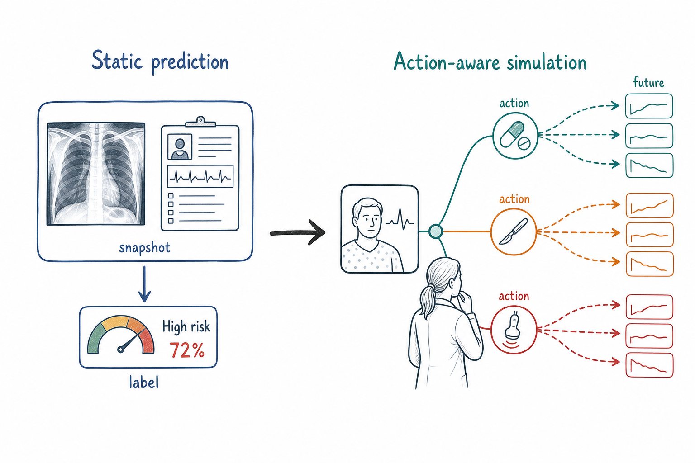

<a id="top"></a>
<p align="center"></p>

<h1 align="center">🏥 Awesome Medical World Models</h1>
<p align="center"><b>From static prediction to clinically valid, action-aware simulation.</b></p>
<p align="center">
  <a href="https://awesome.re"></a>
  
  
  
  
  <a href="CONTRIBUTING.md"></a>
  
</p>

> **From static prediction to clinically valid, action-aware simulation.**  
> A curated, **capability-coded** map of medical world models. Every paper is placed on a **capability ladder** (how far it reaches) and audited with a **SATO-V** rubric (which evidence it actually has), so that *"looks like a world model"* and *"supports a clinical decision"* can finally be told apart.

- 📚 Total papers: **161**
- 💻 With open-source code: **13**
- 🌟 Core (self-identified) world models: **26**
- 🪜 Capability levels: **6** (L0 · L1 · L1b · L2 · L3 · L4)
- 🗂️ Tracks: **7**
- ✅ Last verified: **2026-06-10**
- 🌐 Language: **English** | [中文](./README_zh.md)

## 📑 Contents

- [Category Overview](#overview)
- [Featured: Open-Source Models](#featured)
- [📚 Catalog](#catalog)
  - [Definitions, Reviews & Digital Twins](#t1)
  - [Medical Imaging World Models](#t2)
  - [Longitudinal Disease Progression](#t3)
  - [EHR & Patient-Trajectory Models](#t4)
  - [Counterfactuals & Treatment Planning](#t5)
  - [Surgical, Robotic & Physiology Models](#t6)
  - [Foundational & Background Methods](#t7)
- [Contributing](#contributing)
- [Citation](#citation)

## 🪜 The Capability Ladder

| Level | Meaning |
| :---: | --- |
|  | static prediction |
|  | future prediction |
|  | continuous-time conditional simulation (boundary) |
|  | action-conditioned simulation |
|  | counterfactual reasoning |
|  | planning & control |

**SATO-V** = **S**tate · **A**ction · **T**ransition · **O**utcome · **V**alidation — the five components a medical world-model claim should evidence.

**Markers:** 🌟 core paper ·  open-source available · level badges colored by the ladder above.

<a id="overview"></a>
## 🗂️ Category Overview

| Track | Papers | Open-source |
| --- | ---: | ---: |
| [Definitions, Reviews & Digital Twins](#t1) | 74 | 2 |
| [Medical Imaging World Models](#t2) | 7 | 3 |
| [Longitudinal Disease Progression](#t3) | 16 | 2 |
| [EHR & Patient-Trajectory Models](#t4) | 24 | 1 |
| [Counterfactuals & Treatment Planning](#t5) | 19 | 1 |
| [Surgical, Robotic & Physiology Models](#t6) | 16 | 4 |
| [Foundational & Background Methods](#t7) | 5 | 0 |
| **Total** | **161** | **13** |

|  |  |  |  |  |  |
| :---: | :---: | :---: | :---: | :---: | :---: |
| 11 | 33 | 1 | 46 | 6 | 64 |

> A high count at `L4` does **not** mean clinical readiness — most carry planning/control *language* with retrospective or simulated evidence. Counterfactual reasoning (`L3`) is the sparsest level, and prospective validation is rare.

<a id="featured"></a>
## 🚀 Featured: Open-Source Medical World Models

The subset with publicly available code — the most directly reusable work.

| Paper | Level | Links | Code | Summary |
| --- | :---: | --- | :---: | --- |
| **Toward Enabling Cardiac Digital Twins of Myocardial Infarction Using Deep Computational Models for Inverse Inference** <br><sub>Lei Li et al. · IEEE Transactions on Medical Imaging · 2024</sub> |  | [Paper](https://doi.org/10.1109/tmi.2024.3367409) · [PDF](https://ieeexplore.ieee.org/ielx7/42/4359023/10440104.pdf) | [](https://github.com/lileitech/mi_inverse_inference) | Cardiac digital twins (CDTs) have the potential to offer individualized evaluation of cardiac function in a non-invasive manner, making them a… |
| **Cardiac digital twins at scale from MRI: Open tools and representative models from ~ 55000 UK Biobank participants** <br><sub>Devran Uğurlu et al. · PLoS ONE · 2025</sub> |  | [Paper](https://doi.org/10.1371/journal.pone.0327158) · [PDF](https://journals.plos.org/plosone/article/file?id=10.1371/journal.pone.0327158&type=printable) | [](https://github.com/cdttk/biv-volumetric-meshing) | A cardiac digital twin is a virtual replica of a patient's heart for screening, diagnosis, prognosis, risk assessment, and treatment planning of… |
| 🌟 **CheXWorld: Exploring Image World Modeling for Radiograph Representation Learning** <br><sub>Yang Yue et al. · 2025</sub> |  | [Paper](https://arxiv.org/abs/2504.13820) | [](https://github.com/leaplabthu/chexworld) | Humans can develop internal world models that encode common sense knowledge, telling them how the world works and predicting the consequences of… |
| 🌟 **MRI Contrast Enhancement Kinetics World Model** <br><sub>Jindi Kong et al. · arXiv · 2026</sub> |  | [Paper](https://arxiv.org/abs/2602.19285) | [](https://github.com/DD0922/MRI-Contrast-Enhancement-Kinetics-World-Model) | Clinical MRI contrast acquisition suffers from inefficient information yield. |
| 🌟 **Beyond Generative Priors: Minority Sampling with JEPA-Guided Diffusion** <br><sub>Sol Park et al. · arXiv · 2026</sub> |  | [Paper](https://doi.org/10.48550/arxiv.2605.24631) | [](https://github.com/soobin-um/jepa-guidance) | Minority sampling aims to generate low-density instances on a data manifold and is of central importance in applications such as medical diagnosis,… |
| **Brain Latent Progression: Individual-based spatiotemporal disease progression on 3D Brain MRIs via latent diffusion** <br><sub>Lemuel Puglisi et al. · Medical Image Analysis · 2025</sub> |  | [Paper](https://doi.org/10.1016/j.media.2025.103734) | [](https://github.com/lemuelpuglisi/brlp) | The growing availability of longitudinal Magnetic Resonance Imaging (MRI) datasets has facilitated Artificial Intelligence (AI)-driven modeling of… |
| **Explicit Temporal Embedding in Deep Generative Latent Models for Longitudinal Medical Image Synthesis** <br><sub>Julian Schön et al. · arXiv · 2023</sub> |  | [Paper](https://arxiv.org/abs/2301.05465) | [](https://github.com/julschoen/temp-gan) | Medical imaging plays a vital role in modern diagnostics and treatment. |
| 🌟 **LeJEPA + I-JEPA: A World-Model-Grounded Multi-Agent Framework for Medical AGI** <br><sub>Frank Morales · Zenodo (CERN European Organization for Nuclear Research) · 2026</sub> |  | [Paper](https://doi.org/10.5281/zenodo.20101620) |  | Executive Summary: LeJEPA + I-JEPA Medical AGI LEJEPA_IJEPA_MEDICAL_AGI is an open-source, multi-agent framework designed to achieve clinically… |
| **auton-survival: an Open-Source Package for Regression, Counterfactual Estimation, Evaluation and Phenotyping with Censored Time-to-Event Data** <br><sub>Chirag Nagpal et al. · arXiv · 2022</sub> |  | [Paper](http://arxiv.org/abs/2204.07276) |  | Applications of machine learning in healthcare often require working with time-to-event prediction tasks including prognostication of an adverse… |
| 🌟 **SWoMo: Neuro-Symbolic World Model for Cataract Surgery Simulation** <br><sub>S Sivakumar et al. · arXiv · 2026</sub> |  | [Paper](https://arxiv.org/abs/2605.16530) |  | Realistic surgical simulation plays a crucial role in training novice surgeons and in the development of autonomous agents. |
| 🌟 **World Models for General Surgical Grasping** <br><sub>Hongbin Lin · 2024</sub> |  | [Paper](https://arxiv.org/abs/2405.17940) |  | Intelligent vision control systems for surgical robots should adapt to unknown and diverse objects while being robust to system disturbances.Previous… |
| 🌟 **EchoWorld: Learning Motion-Aware World Models for Echocardiography Probe Guidance** <br><sub>Yang Yue et al. · arXiv · 2025</sub> |  | [Paper](https://arxiv.org/abs/2504.13065) | [](https://github.com/leaplabthu/echoworld) | Echocardiography is crucial for cardiovascular disease detection but relies heavily on experienced sonographers. |
| **Surgical embodied intelligence for generalized task autonomy in laparoscopic robot-assisted surgery** <br><sub>Yonghao Long et al. · Science Robotics · 2025</sub> |  | [Paper](https://doi.org/10.1126/scirobotics.adt3093) |  | Surgical robots capable of autonomously performing various tasks could enhance efficiency and augment human productivity in addressing clinical needs. |

<a id="catalog"></a>
## 📚 Catalog

_Within each track, papers are sorted core-first, then by year (newest first)._

<a id="t1"></a>
### Definitions, Reviews & Digital Twins  ·  74 papers  ·  2 open-source

| Paper | Level | Links | Code | Summary |
| --- | :---: | --- | :---: | --- |
| 🌟 **Medical World Model: From Passive Prediction to Active Simulation in Medicine** <br><sub>Numan Saeed et al. · Preprints.org · 2026</sub> |  | [Paper](https://doi.org/10.20944/preprints202604.2168.v1) | — | Clinical care is interventional. Physicians must decide how a patient's trajectory is likely to change under competing actions, not only estimate… |
| 🌟 **Beyond Generative AI: World Models for Clinical Prediction, Counterfactuals, and Planning** <br><sub>Mohammad Areeb Qazi et al. · arXiv · 2025</sub> |  | [Paper](https://arxiv.org/abs/2511.16333) | — | Healthcare requires AI that is predictive, reliable, and data-efficient. |
| **Digital Twins Framework for Clinical Decision-Centric Co-Management of Patient Monitoring and Environment Management** <br><sub>Wei Liu et al. · IEEE Journal of Biomedical and Health Informatics · 2026</sub> |  | [Paper](https://doi.org/10.1109/jbhi.2026.3659650) | — | The convergence of continuous physiological monitoring and intelligent building systems in smart clinics offers a transformative opportunity for… |
| **A comprehensive review of digital twin in healthcare in the scope of simulative health-monitoring** <br><sub>Mubaris Nadeem et al. · Digital Health · 2025</sub> |  | [Paper](https://doi.org/10.1177/20552076241304078) | — | Objective: Digital twins (DTs) emerged in the wake of Industry 4.0 and the creation of cyber-physical systems, motivated by the increased… |
| **A consensus statement on the use of digital twins in medicine** <br><sub>Jeffrey David Iqbal et al. · npj Digital Medicine · 2025</sub> |  | [Paper](https://doi.org/10.1038/s41746-025-01897-4) · [PDF](https://www.nature.com/articles/s41746-025-01897-4.pdf) | — | Digital Health Technologies represent a marked shift from current medical technologies in use, the approach to health and healthcare and stakeholders… |
| **A systematic review of AI as a digital twin for prostate cancer care** <br><sub>Annette John et al. · Computer Methods and Programs in Biomedicine · 2025</sub> |  | [Paper](https://doi.org/10.1016/j.cmpb.2025.108804) | — | Artificial Intelligence (AI) and Digital Twin (DT) technologies are rapidly transforming healthcare, offering the potential for personalized,… |
| **AI-powered in silico twins: redefining precision medicine through simulation, personalization, and predictive healthcare** <br><sub>Sitah Alharthi · Saudi Pharmaceutical Journal · 2025</sub> |  | [Paper](https://doi.org/10.1007/s44446-025-00055-x) · [PDF](https://link.springer.com/content/pdf/10.1007/s44446-025-00055-x.pdf) | — | In silico twins (ISTs) are emerging as a transformative paradigm in precision medicine, offering dynamic, high-fidelity representations of individual… |
| **Advancing Health Care With Digital Twins: Meta-Review of Applications and Implementation Challenges** <br><sub>Mickaël Ringeval et al. · Journal of Medical Internet Research · 2025</sub> |  | [Paper](https://doi.org/10.2196/69544) | — | BACKGROUND: Digital twins (DTs) are digital representations of real-world systems, enabling advanced simulations, predictive modeling, and real-time… |
| **Cardiac digital twins at scale from MRI: Open tools and representative models from ~ 55000 UK Biobank participants** <br><sub>Devran Uğurlu et al. · PLoS ONE · 2025</sub> |  | [Paper](https://doi.org/10.1371/journal.pone.0327158) · [PDF](https://journals.plos.org/plosone/article/file?id=10.1371/journal.pone.0327158&type=printable) | [](https://github.com/cdttk/biv-volumetric-meshing) | A cardiac digital twin is a virtual replica of a patient's heart for screening, diagnosis, prognosis, risk assessment, and treatment planning of… |
| **Computational Nuclear Oncology Toward Precision Radiopharmaceutical Therapies: Ethical, Regulatory, and Socioeconomic Dimensions of Theranostic Digital Twins** <br><sub>Lidia Strigari et al. · Journal of Nuclear Medicine · 2025</sub> |  | [Paper](https://doi.org/10.2967/jnumed.124.268186) · [PDF](https://jnm.snmjournals.org/content/jnumed/early/2025/01/23/jnumed.124.268186.full.pdf) | — | Computational nuclear oncology for precision radiopharmaceutical therapy (RPT) is a new frontier for theranostic treatment personalization. |
| **Current and future use of artificial intelligence in valvular heart disease imaging** <br><sub>Partho P. Sengupta et al. · European Heart Journal - Cardiovascular Imaging · 2025</sub> |  | [Paper](https://doi.org/10.1093/ehjci/jeaf348) | — | Valvular heart disease (VHD) remains significantly underdiagnosed and undertreated. |
| **Current progress of digital twin construction using medical imaging** <br><sub>Feng Zhao et al. · Journal of Applied Clinical Medical Physics · 2025</sub> |  | [Paper](https://doi.org/10.1002/acm2.70226) | — | Medical imaging is fundamental to digital twin technology, enabling patient-specific virtual models of anatomy and physiology. |
| **Design and analysis of TwinCardio framework to detect and monitor cardiovascular diseases using digital twin and deep neural network** <br><sub>Aarthi Iyer et al. · Scientific Reports · 2025</sub> |  | [Paper](https://doi.org/10.1038/s41598-025-08824-3) · [PDF](https://www.nature.com/articles/s41598-025-08824-3.pdf) | — | World Health Organization (WHO) estimates 17.9 million deaths globally every year due to Cardiovascular Disease or CVD, which includes an array of… |
| **Digital Twin Models in Atrial Fibrillation: Charting the Future of Precision Therapy?** <br><sub>Paschalis Karakasis et al. · Journal of Personalized Medicine · 2025</sub> |  | [Paper](https://doi.org/10.3390/jpm15060256) · [PDF](https://www.mdpi.com/2075-4426/15/6/256/pdf?version=1750068603) | — | Atrial fibrillation (AF) is the most common sustained arrhythmia and a major contributor to stroke and cardiovascular morbidity. |
| **Digital twin assisted surgery, concept, opportunities, and challenges** <br><sub>Lisa Asciak et al. · npj Digital Medicine · 2025</sub> |  | [Paper](https://doi.org/10.1038/s41746-024-01413-0) · [PDF](https://www.nature.com/articles/s41746-024-01413-0.pdf) | — | Computer-assisted surgery is becoming essential in modern medicine to accurately plan, guide, and perform surgeries. |
| **Digital twin for personalized medicine development** <br><sub>Saniya Saratkar et al. · Frontiers in Digital Health · 2025</sub> |  | [Paper](https://doi.org/10.3389/fdgth.2025.1583466) · [PDF](https://www.frontiersin.org/journals/digital-health/articles/10.3389/fdgth.2025.1583466/pdf) | — | Digital Twin (DT) technology is revolutionizing healthcare by enabling real-time monitoring, predictive analytics, and highly personalized medical… |
| **Digital twin systems for musculoskeletal applications: A current concepts review** <br><sub>Pedro Diniz et al. · Knee Surgery Sports Traumatology Arthroscopy · 2025</sub> |  | [Paper](https://doi.org/10.1002/ksa.12627) | — | Digital twin (DT) systems, which involve creating virtual replicas of physical objects or systems, have the potential to transform healthcare by… |
| **Digital twins in healthcare IoT: A systematic review** <br><sub>Md Rafiul Kabir et al. · High-Confidence Computing · 2025</sub> |  | [Paper](https://doi.org/10.1016/j.hcc.2025.100340) | — | Digital twin technology initially marked its presence in production and engineering, subsequently revolutionizing the healthcare sector with its… |
| **Digital twins in healthcare: a comprehensive review and future directions** <br><sub>Hamid Khoshfekr Rudsari et al. · Frontiers in Digital Health · 2025</sub> |  | [Paper](https://doi.org/10.3389/fdgth.2025.1633539) | — | Digital Twin (DT) technology has emerged as a transformative force in healthcare, offering unprecedented opportunities for personalized medicine,… |
| **EfficientNet in Digital Twin-based Cardiac Arrest Prediction and Analysis** <br><sub>Qasim Zia et al. · arXiv · 2025</sub> |  | [Paper](http://arxiv.org/abs/2509.07388) | — | Cardiac arrest is one of the biggest global health problems, and early identification and management are key to enhancing the patient's prognosis. |
| **Enhancing premature ventricular contraction localization through electrocardiographic imaging and cardiac digital twins** <br><sub>Jorge Sánchez et al. · Computers in Biology and Medicine · 2025</sub> |  | [Paper](https://doi.org/10.1016/j.compbiomed.2025.109994) | — | Premature ventricular contractions (PVCs) represent a common and clinically significant cardiac arrhythmia, contributing to a spectrum of… |
| **From data-driven cities to data-driven tumors: dynamic digital twins for adaptive oncology** <br><sub>İrem Karaman et al. · Frontiers in Artificial Intelligence · 2025</sub> |  | [Paper](https://doi.org/10.3389/frai.2025.1624877) · [PDF](https://public-pages-files-2025.frontiersin.org/journals/artificial-intelligence/articles/10.3389/frai.2025.1624877/pdf) | — | IntroductionOncology is undergoing a transformation due to the advent of digital twin technology, which enables precision therapy by creating… |
| **From virtual to reality: innovative practices of digital twins in tumor therapy** <br><sub>Shiying Shen et al. · Journal of Translational Medicine · 2025</sub> |  | [Paper](https://doi.org/10.1186/s12967-025-06371-z) · [PDF](https://translational-medicine.biomedcentral.com/counter/pdf/10.1186/s12967-025-06371-z) | — | BACKGROUND: As global cancer incidence and mortality rise, digital twin technology in precision medicine offers new opportunities for cancer… |
| **Large language models forecast patient health trajectories enabling digital twins** <br><sub>Nikita Makarov et al. · npj Digital Medicine · 2025</sub> |  | [Paper](https://doi.org/10.1038/s41746-025-02004-3) · [PDF](https://www.nature.com/articles/s41746-025-02004-3.pdf) | — | Generative artificial intelligence is revolutionizing digital twin development, enabling virtual patient representations that predict health… |
| **Large language models-enabled digital twins for precision medicine in rare gynecological tumors** <br><sub>Jacqueline Lammert et al. · npj Digital Medicine · 2025</sub> |  | [Paper](https://doi.org/10.1038/s41746-025-01810-z) · [PDF](https://www.nature.com/articles/s41746-025-01810-z.pdf) | — | Rare gynecological tumors (RGTs) present major clinical challenges due to their low incidence and heterogeneity. |
| **Medical digital twins: enabling precision medicine and medical artificial intelligence** <br><sub>Christoph Sadée et al. · The Lancet Digital Health · 2025</sub> |  | [Paper](https://doi.org/10.1016/j.landig.2025.02.004) | — | The notion of medical digital twins is gaining popularity both within the scientific community and among the general public; however, much of the… |
| **Patient-Specific Digital Twins for Personalized Healthcare: A Hybrid AI and Simulation-Based Framework** <br><sub>Harshit Sharma et al. · IEEE Access · 2025</sub> |  | [Paper](https://doi.org/10.1109/access.2025.3598130) | — | Digital twins (DTs) represent a transformative paradigm in personalized medicine, enabling real-time, patient-specific simulations that support… |
| **The Era of Preemptive Medicine: Developing Medical Digital Twins through Omics, IoT, and AI Integration** <br><sub>Tadao Ooka · JMA Journal · 2025</sub> |  | [Paper](https://doi.org/10.31662/jmaj.2024-0213) | — | Preemptive medicine represents a paradigm shift from reactive treatment to proactive disease prevention. |
| **Building Digital Twins for Cardiovascular Health: From Principles to Clinical Impact** <br><sub>Kaan Sel et al. · Journal of the American Heart Association · 2024</sub> |  | [Paper](https://doi.org/10.1161/jaha.123.031981) | — | The past several decades have seen rapid advances in diagnosis and treatment of cardiovascular diseases and stroke, enabled by technological… |
| **Cardiovascular care with digital twin technology in the era of generative artificial intelligence** <br><sub>Phyllis Thangaraj et al. · European Heart Journal · 2024</sub> |  | [Paper](https://pure.amsterdamumc.nl/en/publications/975b33dd-1b1e-4cd7-bf4d-dd99083f860e) · [PDF](https://discovery.ucl.ac.uk/10199941/1/EHJ_DigitalTwinAIReview_Article_final.pdf) | — | Digital twins, which are in silico replications of an individual and its environment, have advanced clinical decision-making and prognostication in… |
| **Digital Twins Generated by Artificial Intelligence in Personalized Healthcare** <br><sub>M. Łukaniszyn et al. · Applied Sciences · 2024</sub> |  | [Paper](https://doi.org/10.3390/app14209404) · [PDF](https://www.mdpi.com/2076-3417/14/20/9404/pdf?version=1728989109) | — | Digital society strategies in healthcare include the rapid development of digital twins (DTs) for patients and human organs in medical research and… |
| **Digital Twins for Healthcare Using Wearables** <br><sub>Zachary D. Johnson et al. · Bioengineering · 2024</sub> |  | [Paper](https://doi.org/10.3390/bioengineering11060606) · [PDF](https://www.mdpi.com/2306-5354/11/6/606/pdf?version=1718267627) | — | Digital twins are a relatively new form of digital modeling that has been gaining popularity in recent years. |
| **Digital Twins in Urological Oncology: Precise Treatment Planning via Complex Modeling** <br><sub>Enrico Checcucci et al. · European Urology Oncology · 2024</sub> |  | [Paper](https://doi.org/10.1016/j.euo.2024.10.005) | — | Digital twins can revolutionize personalized medicine by providing virtual simulations for optimized treatment planning and patient care. |
| **Digital Twins’ Advancements and Applications in Healthcare, Towards Precision Medicine** <br><sub>Konstantinos Papachristou et al. · Journal of Personalized Medicine · 2024</sub> |  | [Paper](https://doi.org/10.3390/jpm14111101) · [PDF](https://www.mdpi.com/2075-4426/14/11/1101/pdf?version=1731319712) | — | This review examines the significant influence of Digital Twins (DTs) and their variant, Digital Human Twins (DHTs), on the healthcare field. |
| **Digital twinning of the human ventricular activation sequence to Clinical 12-lead ECGs and magnetic resonance imaging using realistic Purkinje networks for in silico clinical trials** <br><sub>Julià Camps et al. · Medical Image Analysis · 2024</sub> |  | [Paper](https://doi.org/10.1016/j.media.2024.103108) | — | Cardiac in silico clinical trials can virtually assess the safety and efficacy of therapies using human-based modelling and simulation. |
| **Digital twins for health: a scoping review** <br><sub>Evangelia Katsoulakis et al. · npj Digital Medicine · 2024</sub> |  | [Paper](https://doi.org/10.1038/s41746-024-01073-0) · [PDF](https://www.nature.com/articles/s41746-024-01073-0.pdf) | — | The use of digital twins (DTs) has proliferated across various fields and industries, with a recent surge in the healthcare sector. |
| **Digital twins in dermatology, current status, and the road ahead** <br><sub>Hossein Akbarialiabad et al. · npj Digital Medicine · 2024</sub> |  | [Paper](https://doi.org/10.1038/s41746-024-01220-7) · [PDF](https://www.nature.com/articles/s41746-024-01220-7.pdf) | — | Digital twins, innovative virtual models synthesizing real-time biological, environmental, and lifestyle data, herald a new era in personalized… |
| **Dynamic mirroring: unveiling the role of digital twins, artificial intelligence and synthetic data for personalized medicine in laboratory medicine** <br><sub>Andrea Padoan et al. · Clinical Chemistry and Laboratory Medicine (CCLM) · 2024</sub> |  | [Paper](https://doi.org/10.1515/cclm-2024-0517) · [PDF](https://www.research.unipd.it/bitstream/11577/3521677/1/10.1515_cclm-2024-0517.pdf) | — | In recent years, the integration of technological advancements and digitalization into healthcare has brought about a remarkable transformation in… |
| **Envisioning the Future of Personalized Medicine: Role and Realities of Digital Twins** <br><sub>Alexandre Vallée · Journal of Medical Internet Research · 2024</sub> |  | [Paper](https://doi.org/10.2196/50204) · [PDF](https://www.jmir.org/2024/1/e50204/PDF) | — | Digital twins have emerged as a groundbreaking concept in personalized medicine, offering immense potential to transform health care delivery and… |
| **From virtual patients to digital twins in immuno-oncology: lessons learned from mechanistic quantitative systems pharmacology modeling** <br><sub>Hanwen Wang et al. · npj Digital Medicine · 2024</sub> |  | [Paper](https://doi.org/10.1038/s41746-024-01188-4) · [PDF](https://www.nature.com/articles/s41746-024-01188-4.pdf) | — | Virtual patients and digital patients/twins are two similar concepts gaining increasing attention in health care with goals to accelerate drug… |
| **Internet of Things-based Smart Health Monitoring and Virtual Patient Simulation Systems, Deep Learning-based Medical Imaging and Brain–Computer Interface Technologies, and Digital Twin-based Clinical and Medical Care Pro** <br><sub>American Journal of Medical Research · 2024</sub> |  | [Paper](https://doi.org/10.22381/ajmr11120245) · [PDF](https://addletonacademicpublishers.com/files/3150/Deep-Learning/3136/5-Horak-et-al.pdf) | — | metadata-only candidate; needs reading note |
| **Toward Enabling Cardiac Digital Twins of Myocardial Infarction Using Deep Computational Models for Inverse Inference** <br><sub>Lei Li et al. · IEEE Transactions on Medical Imaging · 2024</sub> |  | [Paper](https://doi.org/10.1109/tmi.2024.3367409) · [PDF](https://ieeexplore.ieee.org/ielx7/42/4359023/10440104.pdf) | [](https://github.com/lileitech/mi_inverse_inference) | Cardiac digital twins (CDTs) have the potential to offer individualized evaluation of cardiac function in a non-invasive manner, making them a… |
| **Digital Twins for Patient Care via Knowledge Graphs and Closed-Form Continuous-Time Liquid Neural Networks** <br><sub>Logan Nye · arXiv · 2023</sub> |  | [Paper](http://arxiv.org/abs/2307.04772) | — | Digital twin technology has is anticipated to transform healthcare, enabling personalized medicines and support, earlier diagnoses, simulated… |
| **Digital Twins in Healthcare: A Survey of Current Methods** <br><sub>Siddharth Ghatti et al. · Archives of Clinical and Biomedical Research · 2023</sub> |  | [Paper](https://doi.org/10.26502/acbr.50170352) | — | Digital twin technology has been increasingly applied in healthcare and patient well-being in recent years. |
| **Digital Twins: The New Frontier for Personalized Medicine?** <br><sub>Michaela Cellina et al. · Applied Sciences · 2023</sub> |  | [Paper](https://doi.org/10.3390/app13137940) · [PDF](https://www.mdpi.com/2076-3417/13/13/7940/pdf?version=1688650020) | — | Digital twins are virtual replicas of physical objects or systems. |
| **Digital twin for healthcare systems** <br><sub>Alexandre Vallée · Frontiers in Digital Health · 2023</sub> |  | [Paper](https://doi.org/10.3389/fdgth.2023.1253050) · [PDF](https://www.frontiersin.org/articles/10.3389/fdgth.2023.1253050/pdf?isPublishedV2=False) | — | Digital twin technology is revolutionizing healthcare systems by leveraging real-time data integration, advanced analytics, and virtual simulations… |
| **Digital twin in healthcare: Recent updates and challenges** <br><sub>Tianze Sun et al. · Digital Health · 2023</sub> |  | [Paper](https://doi.org/10.1177/20552076221149651) | — | As simulation is playing an increasingly important role in medicine, providing the individual patient with a customised diagnosis and treatment is… |
| **Intelligent Digital Twins for Personalized Migraine Care** <br><sub>Parisa Gazerani · Journal of Personalized Medicine · 2023</sub> |  | [Paper](https://doi.org/10.3390/jpm13081255) · [PDF](https://www.mdpi.com/2075-4426/13/8/1255/pdf?version=1691979806) | — | Intelligent digital twins closely resemble their real-life counterparts. |
| **Mapping the use of computational modelling and simulation in clinics: A survey** <br><sub>R Lesage et al. · Frontiers in Medical Technology · 2023</sub> |  | [Paper](https://doi.org/10.3389/fmedt.2023.1125524) · [PDF](https://www.frontiersin.org/articles/10.3389/fmedt.2023.1125524/pdf) | — | In silico medicine describes the application of computational modelling and simulation (CM&amp;amp;S) to the study, diagnosis, treatment or… |
| **Opportunities and challenges of digital twin technology in healthcare** <br><sub>Mingbang Wang et al. · Chinese Medical Journal · 2023</sub> |  | [Paper](https://doi.org/10.1097/cm9.0000000000002896) | — | To the Editor: The classic case considered to be the primary application of the digital twin approach is the Apollo 13 mission in 1970. |
| **Predictive digital twin for optimizing patient-specific radiotherapy regimens under uncertainty in high-grade gliomas** <br><sub>Anirban Chaudhuri et al. · Frontiers in Artificial Intelligence · 2023</sub> |  | [Paper](https://doi.org/10.3389/frai.2023.1222612) · [PDF](https://www.frontiersin.org/articles/10.3389/frai.2023.1222612/pdf?isPublishedV2=False) | — | We develop a methodology to create data-driven predictive digital twins for optimal risk-aware clinical decision-making. |
| **Systems‐based digital twins to help characterize clinical <scp>dose–response</scp> and propose predictive biomarkers in a Phase I study of bispecific antibody, mosunetuzumab, in <scp>NHL</scp>** <br><sub>Monica Susilo et al. · Clinical and Translational Science · 2023</sub> |  | [Paper](https://doi.org/10.1111/cts.13501) | — | Phase I oncology clinical trials often comprise a limited number of patients representing different disease subtypes who are divided into cohorts… |
| **The potential and pitfalls of artificial intelligence in clinical pharmacology** <br><sub>Martin Johnson et al. · CPT Pharmacometrics & Systems Pharmacology · 2023</sub> |  | [Paper](https://doi.org/10.1002/psp4.12902) | — | Artificial intelligence (AI) involves using data and algorithms to perform activities normally achieved through human intelligence. |
| **Towards Enabling Cardiac Digital Twins of Myocardial Infarction Using Deep Computational Models for Inverse Inference** <br><sub>Lei Li et al. · arXiv · 2023</sub> |  | [Paper](http://arxiv.org/abs/2307.04421) | — | Cardiac digital twins (CDTs) have the potential to offer individualized evaluation of cardiac function in a non-invasive manner, making them a… |
| **Up digital and personal: How heart digital twins can transform heart patient care** <br><sub>Natalia A. Trayanova et al. · Heart Rhythm · 2023</sub> |  | [Paper](https://doi.org/10.1016/j.hrthm.2023.10.019) | — | Precision medicine is the vision of health care where therapy is tailored to each patient. |
| **A multidisciplinary approach to the development of digital twin models of critical care delivery in intensive care units** <br><sub>Xiang Zhong et al. · International Journal of Production Research · 2022</sub> |  | [Paper](https://doi.org/10.1080/00207543.2021.2022235) | — | To investigate critical care delivery in intensive care units (ICUs), we propose a qualitative and quantitative coupling approach to developing an… |
| **Building digital twins of the human immune system: toward a roadmap** <br><sub>Reinhard Laubenbacher et al. · npj Digital Medicine · 2022</sub> |  | [Paper](https://doi.org/10.1038/s41746-022-00610-z) · [PDF](https://www.nature.com/articles/s41746-022-00610-z.pdf) | — | Digital twins, customized simulation models pioneered in industry, are beginning to be deployed in medicine and healthcare, with some major… |
| **Conceptual Approach for a Digital Twin of Medical Devices** <br><sub>Roberto Riascos et al. · Advances in transdisciplinary engineering · 2022</sub> |  | [Paper](https://doi.org/10.3233/atde220661) | — | Over the last few years, a concept called Digital Twin has emerged continuously as a comprehensive approach in industrial domains. |
| **Digital Twin Frameworks for Simulating Multiscale Patient Physiology in Precision Oncology: A Review of Real-Time Data Assimilation, Predictive Tumor Modeling, and Clinical Decision Interfaces** <br><sub>Olasehinde Omolayo et al. · International Journal of Multidisciplinary Futuristic Development · 2022</sub> |  | [Paper](https://doi.org/10.54660/ijmfd.2022.3.1.1-8) · [PDF](https://www.transdisciplinaryjournal.com/uploads/archives/20250728162610_MFD-2025-1-005.1.pdf) | — | Digital twin (DT) technology has emerged as a transformative paradigm in precision oncology, enabling real-time, multiscale simulation of… |
| **Digital Twin Technology: The Future of Predicting Neurological Complications of Pediatric Cancers and Their Treatment** <br><sub>Grace M. Thiong’o et al. · Frontiers in Oncology · 2022</sub> |  | [Paper](https://doi.org/10.3389/fonc.2021.781499) · [PDF](https://www.frontiersin.org/articles/10.3389/fonc.2021.781499/pdf) | — | Healthcare technologies have seen a surge in utilization during the COVID 19 pandemic. |
| **HDL: Hybrid Deep Learning for the Synthesis of Myocardial Velocity Maps in Digital Twins for Cardiac Analysis** <br><sub>Xiaodan Xing et al. · IEEE Journal of Biomedical and Health Informatics · 2022</sub> |  | [Paper](https://doi.org/10.1109/jbhi.2022.3158897) | — | Synthetic digital twins based on medical data accelerate the acquisition, labelling and decision making procedure in digital healthcare. |
| **Integrating mechanism-based modeling with biomedical imaging to build practical digital twins for clinical oncology** <br><sub>Chengyue Wu et al. · Biophysics Reviews · 2022</sub> |  | [Paper](https://doi.org/10.1063/5.0086789) | — | Digital twins employ mathematical and computational models to virtually represent a physical object (e.g., planes and human organs), predict the… |
| **The Digital Twin in Medicine: A Key to the Future of Healthcare?** <br><sub>Tianze Sun et al. · Frontiers in Medicine · 2022</sub> |  | [Paper](https://doi.org/10.3389/fmed.2022.907066) · [PDF](https://www.frontiersin.org/articles/10.3389/fmed.2022.907066/pdf) | — | There is a growing need for precise diagnosis and personalized treatment of disease in recent years. |
| **The health digital twin to tackle cardiovascular disease—a review of an emerging interdisciplinary field** <br><sub>Genevieve Coorey et al. · npj Digital Medicine · 2022</sub> |  | [Paper](https://doi.org/10.1038/s41746-022-00640-7) · [PDF](https://www.nature.com/articles/s41746-022-00640-7.pdf) | — | Potential benefits of precision medicine in cardiovascular disease (CVD) include more accurate phenotyping of individual patients with the same… |
| **Theranostic digital twins for personalized radiopharmaceutical therapies: Reimagining theranostics via computational nuclear oncology** <br><sub>Arman Rahmim et al. · Frontiers in Oncology · 2022</sub> |  | [Paper](https://doi.org/10.3389/fonc.2022.1062592) · [PDF](https://www.frontiersin.org/articles/10.3389/fonc.2022.1062592/pdf) | — | This work emphasizes that patient data, including images, are not operable (clinically), but that digital twins are. |
| **Toward a Digital Twin for Arthroscopic Knee Surgery: A Systematic Review** <br><sub>Øystein Bjelland et al. · IEEE Access · 2022</sub> |  | [Paper](https://doi.org/10.1109/access.2022.3170108) · [PDF](https://ieeexplore.ieee.org/ielx7/6287639/9668973/09762655.pdf) | — | The use of digital twins to represent a product or process digitally is trending in many engineering disciplines. |
| **A Framework for the generation of digital twins of cardiac electrophysiology from clinical 12-leads ECGs** <br><sub>Karli Gillette et al. · Medical Image Analysis · 2021</sub> |  | [Paper](https://doi.org/10.1016/j.media.2021.102080) | — | Cardiac digital twins (Cardiac Digital Twin (CDT)s) of human electrophysiology (Electrophysiology (EP)) are digital replicas of patient hearts… |
| **A Vision for Leveraging the Concept of Digital Twins to Support the Provision of Personalized Cancer Care** <br><sub>Nilmini Wickramasinghe et al. · IEEE Internet Computing · 2021</sub> |  | [Paper](https://doi.org/10.1109/mic.2021.3065381) | — | Exploring the opportunity for applying digital twins in the healthcare context is an emerging research area that has the potential to support more… |
| **Development of Digital Twins to Optimize Trauma Surgery and Postoperative Management. A Case Study Focusing on Tibial Plateau Fracture** <br><sub>Kévin Aubert et al. · Frontiers in Bioengineering and Biotechnology · 2021</sub> |  | [Paper](https://doi.org/10.3389/fbioe.2021.722275) · [PDF](https://www.frontiersin.org/articles/10.3389/fbioe.2021.722275/pdf) | — | Background and context: Surgical procedures are evolving toward less invasive and more tailored approaches to consider the specific pathology,… |
| **Digital Twins for Multiple Sclerosis** <br><sub>Isabel Voigt et al. · Frontiers in Immunology · 2021</sub> |  | [Paper](https://doi.org/10.3389/fimmu.2021.669811) · [PDF](https://www.frontiersin.org/articles/10.3389/fimmu.2021.669811/pdf) | — | An individualized innovative disease management is of great importance for people with multiple sclerosis (pwMS) to cope with the complexity of this… |
| **Graph Representation Forecasting of Patient's Medical Conditions: Toward a Digital Twin** <br><sub>Pietro Barbiero et al. · Frontiers in Genetics · 2021</sub> |  | [Paper](https://doi.org/10.3389/fgene.2021.652907) · [PDF](https://www.frontiersin.org/articles/10.3389/fgene.2021.652907/pdf) | — | Objective: Modern medicine needs to shift from a wait and react, curative discipline to a preventative, interdisciplinary science aiming at providing… |
| **How artificial intelligence might disrupt diagnostics in hematology in the near future** <br><sub>Wencke Walter et al. · Oncogene · 2021</sub> |  | [Paper](https://doi.org/10.1038/s41388-021-01861-y) · [PDF](https://www.nature.com/articles/s41388-021-01861-y.pdf) | — | Artificial intelligence (AI) is about to make itself indispensable in the health care sector. |
| **Development and Verification of a Digital Twin Patient Model to Predict Specific Treatment Response During the First 24 Hours of Sepsis** <br><sub>Amos Lal et al. · Critical Care Explorations · 2020</sub> |  | [Paper](https://doi.org/10.1097/cce.0000000000000249) | — | To develop and verify a digital twin model of critically ill patient using the causal artificial intelligence approach to predict the response to… |
| **A Novel Cloud-Based Framework for the Elderly Healthcare Services Using Digital Twin** <br><sub>Ying Liu et al. · IEEE Access · 2019</sub> |  | [Paper](https://doi.org/10.1109/access.2019.2909828) · [PDF](https://ieeexplore.ieee.org/ielx7/6287639/8600701/08686260.pdf) | — | With the development of technologies, such as big data, cloud computing, and the Internet of Things (IoT), digital twin is being applied in industry… |

<p align="right"><a href="#top">↑ back to top</a></p>

<a id="t2"></a>
### Medical Imaging World Models  ·  7 papers  ·  3 open-source

| Paper | Level | Links | Code | Summary |
| --- | :---: | --- | :---: | --- |
| 🌟 **A World Model of Radiologist Reading for Medical Image Representation Learning** <br><sub>Yiwei Li et al. · arXiv · 2026</sub> |  | [Paper](https://arxiv.org/abs/2605.23992) | — | Radiologist eye-tracking data provide a rich record of how experts search, compare, and accumulate evidence during image reading; yet, existing… |
| 🌟 **Beyond Generative Priors: Minority Sampling with JEPA-Guided Diffusion** <br><sub>Sol Park et al. · arXiv · 2026</sub> |  | [Paper](https://doi.org/10.48550/arxiv.2605.24631) | [](https://github.com/soobin-um/jepa-guidance) | Minority sampling aims to generate low-density instances on a data manifold and is of central importance in applications such as medical diagnosis,… |
| 🌟 **MRI Contrast Enhancement Kinetics World Model** <br><sub>Jindi Kong et al. · arXiv · 2026</sub> |  | [Paper](https://arxiv.org/abs/2602.19285) | [](https://github.com/DD0922/MRI-Contrast-Enhancement-Kinetics-World-Model) | Clinical MRI contrast acquisition suffers from inefficient information yield. |
| 🌟 **CheXWorld: Exploring Image World Modeling for Radiograph Representation Learning** <br><sub>Yang Yue et al. · 2025</sub> |  | [Paper](https://arxiv.org/abs/2504.13820) | [](https://github.com/leaplabthu/chexworld) | Humans can develop internal world models that encode common sense knowledge, telling them how the world works and predicting the consequences of… |
| 🌟 **Xray2Xray: World Model from Chest X-rays with Volumetric Context** <br><sub>Zefan Yang et al. · arXiv · 2025</sub> |  | [Paper](https://arxiv.org/abs/2506.19055) | — | Chest X-rays (CXRs) are the most widely used medical imaging modality and play a pivotal role in diagnosing diseases. |
| **US-JEPA: A Joint Embedding Predictive Architecture for Ultrasound Imaging** <br><sub>Ashwath Radhachandran et al. · arXiv · 2026</sub> |  | [Paper](https://arxiv.org/abs/2602.19322) | — | Ultrasound (US) imaging poses unique challenges for representation learning due to its inherently noisy acquisition process. |
| **Self-supervised learning of imaging and clinical signatures using a multimodal joint-embedding predictive architecture** <br><sub>Thomas Li et al. · arXiv · 2025</sub> |  | [Paper](https://arxiv.org/abs/2509.15470) | — | The development of multimodal models for pulmonary nodule diagnosis is limited by the scarcity of labeled data and the tendency for these models to… |

<p align="right"><a href="#top">↑ back to top</a></p>

<a id="t3"></a>
### Longitudinal Disease Progression  ·  16 papers  ·  2 open-source

| Paper | Level | Links | Code | Summary |
| --- | :---: | --- | :---: | --- |
| 🌟 **Medical World Model: Generative Simulation of Tumor Evolution for Treatment Planning** <br><sub>Yijun Yang et al. · arXiv · 2025</sub> |  | [Paper](https://arxiv.org/abs/2506.02327) | — | Providing effective treatment and making informed clinical decisions are essential goals of modern medicine and clinical care. |
| **Brain Latent Progression: Individual-based spatiotemporal disease progression on 3D Brain MRIs via latent diffusion** <br><sub>Lemuel Puglisi et al. · Medical Image Analysis · 2025</sub> |  | [Paper](https://doi.org/10.1016/j.media.2025.103734) | [](https://github.com/lemuelpuglisi/brlp) | The growing availability of longitudinal Magnetic Resonance Imaging (MRI) datasets has facilitated Artificial Intelligence (AI)-driven modeling of… |
| **Treatment-aware Diffusion Probabilistic Model for Longitudinal MRI Generation and Diffuse Glioma Growth Prediction** <br><sub>Qinghui Liu et al. · IEEE Transactions on Medical Imaging · 2025</sub> |  | [Paper](https://doi.org/10.1109/tmi.2025.3533038) | — | Diffuse gliomas are malignant brain tumors that grow widespread through the brain. |
| **Conditional Diffusion Model for Longitudinal Medical Image Generation** <br><sub>Duy-Phuong Dao et al. · arXiv · 2024</sub> |  | [Paper](http://arxiv.org/abs/2411.05860) | — | Alzheimers disease progresses slowly and involves complex interaction between various biological factors. |
| **Enhancing Amyloid PET Quantification: MRI-Guided Super-Resolution Using Latent Diffusion Models** <br><sub>Jay Shah et al. · Life · 2024</sub> |  | [Paper](https://doi.org/10.3390/life14121580) · [PDF](https://www.mdpi.com/2075-1729/14/12/1580/pdf?version=1733040705) | — | Amyloid PET imaging plays a crucial role in the diagnosis and research of Alzheimer’s disease (AD), allowing non-invasive detection of amyloid-β… |
| **Explicit Temporal Embedding in Deep Generative Latent Models for Longitudinal Medical Image Synthesis** <br><sub>Julian Schön et al. · arXiv · 2023</sub> |  | [Paper](https://arxiv.org/abs/2301.05465) | [](https://github.com/julschoen/temp-gan) | Medical imaging plays a vital role in modern diagnostics and treatment. |
| **SADM: Sequence-aware Diffusion Model for Longitudinal Medical Image Generation** <br><sub>Jee Seok Yoon et al. · Lecture notes in computer science · 2023</sub> |  | [Paper](https://doi.org/10.1007/978-3-031-34048-2_30) | — | metadata-only candidate; needs reading note |
| **Multi-view prediction of Alzheimer's disease progression via future clinical scores and 3D MRI concurrently** <br><sub>Yan Zhao et al. · Journal of Biomedical Informatics · 2022</sub> |  | [Paper](https://doi.org/10.1016/j.jbi.2021.103978) | — | metadata-only candidate; needs reading note |
| **Self-supervised learning of neighborhood embedding for longitudinal MRI** <br><sub>Jiahong Ouyang et al. · Medical Image Analysis · 2022</sub> |  | [Paper](https://www.ncbi.nlm.nih.gov/pmc/articles/10168684) · [PDF](https://pmc.ncbi.nlm.nih.gov/articles/PMC10168684/pdf/nihms-1896138.pdf) | — | metadata-only candidate; needs reading note |
| **Discovery of Parkinson's disease states and disease progression modelling: a longitudinal data study using machine learning** <br><sub>Kristen Severson et al. · The Lancet Digital Health · 2021</sub> |  | [Paper](https://doi.org/10.1016/s2589-7500(21)00101-1) | — | BACKGROUND: Parkinson's disease is heterogeneous in symptom presentation and progression. |
| **Learning to synthesise the ageing brain without longitudinal data** <br><sub>Tian Xia et al. · Medical Image Analysis · 2021</sub> |  | [Paper](https://doi.org/10.1016/j.media.2021.102169) · [arXiv](https://arxiv.org/abs/1912.02620) | — | metadata-only candidate; needs reading note |
| **Prediction of Alzheimer's Disease Progression with Multi-Information Generative Adversarial Network** <br><sub>Yan Zhao et al. · IEEE Journal of Biomedical and Health Informatics · 2021</sub> |  | [Paper](https://doi.org/10.1109/jbhi.2020.3006925) | — | Alzheimer's disease (AD) is a chronic neurodegenerative disease, and its long-term progression prediction is definitely important. |
| **Trajectories of Perioperative Serum Tumor Markers and Colorectal Cancer Outcomes: A Retrospective, Multicenter Longitudinal Cohort Study** <br><sub>Chunxia Li et al. · EBioMedicine · 2021</sub> |  | [Paper](https://doi.org/10.1016/j.ebiom.2021.103706) | — | BACKGROUND: The dynamic monitoring of perioperative carcinoembryonic antigen (CEA) is recommended by current colorectal cancer (CRC) guidelines,… |
| **LDGAN: Longitudinal-Diagnostic Generative Adversarial Network for Disease Progression Prediction with Missing Structural MRI** <br><sub>Zhenyuan Ning et al. · Lecture notes in computer science · 2020</sub> |  | [Paper](https://doi.org/10.1007/978-3-030-59861-7_18) | — | metadata-only candidate; needs reading note |
| **Predicting PET-derived myelin content from multisequence MRI for individual longitudinal analysis in multiple sclerosis** <br><sub>Wen Wei et al. · NeuroImage · 2020</sub> |  | [Paper](https://doi.org/10.1016/j.neuroimage.2020.117308) | — | Multiple sclerosis (MS) is a demyelinating and inflammatory disease of the central nervous system (CNS). |
| **Deep Ensemble Tensor Factorization for Longitudinal Patient Trajectories Classification** <br><sub>Edward De Brouwer et al. · arXiv · 2018</sub> |  | [Paper](http://arxiv.org/abs/1811.10501) | — | We present a generative approach to classify scarcely observed longitudinal patient trajectories. |

<p align="right"><a href="#top">↑ back to top</a></p>

<a id="t4"></a>
### EHR & Patient-Trajectory Models  ·  24 papers  ·  1 open-source

| Paper | Level | Links | Code | Summary |
| --- | :---: | --- | :---: | --- |
| 🌟 **ChronoMedicalWorld: A Medical World Model for Learning Patient Trajectories from Longitudinal Care Data** <br><sub>Jiangyuan Wang et al. · arXiv · 2026</sub> |  | [Paper](https://arxiv.org/abs/2605.21963) | — | Long-horizon clinical simulation -- predicting how a patient's physiology evolves over years under specified interventions -- is central to… |
| 🌟 **EHRWorld: A Patient-Centric Medical World Model for Long-Horizon Clinical Trajectories** <br><sub>Linjie Mu et al. · arXiv · 2026</sub> |  | [Paper](https://arxiv.org/abs/2602.03569) | — | World models offer a principled framework for simulating future states under interventions, but realizing such models in complex, high-stakes domains… |
| 🌟 **LeJEPA + I-JEPA: A World-Model-Grounded Multi-Agent Framework for Medical AGI** <br><sub>Frank Morales · Zenodo (CERN European Organization for Nuclear Research) · 2026</sub> |  | [Paper](https://doi.org/10.5281/zenodo.20101620) |  | Executive Summary: LeJEPA + I-JEPA Medical AGI LEJEPA_IJEPA_MEDICAL_AGI is an open-source, multi-agent framework designed to achieve clinically… |
| 🌟 **The Patient is not a Moving Document: A World Model Training Paradigm for Longitudinal EHR** <br><sub>Irsyad Adam et al. · arXiv · 2026</sub> |  | [Paper](https://arxiv.org/abs/2601.22128) | — | Large language models (LLMs) trained with next-word-prediction have achieved success as clinical foundation models. |
| **Clin-JEPA: A Multi-Phase Co-Training Framework for Joint-Embedding Predictive Pretraining on EHR Patient Trajectories** <br><sub>Yixuan Yang et al. · arXiv · 2026</sub> |  | [Paper](https://arxiv.org/abs/2605.10840) | — | We present Clin-JEPA, a multi-phase co-training framework for joint-embedding predictive (JEPA) pretraining on EHR patient trajectories. |
| **Systematic review of foundation models for structured electronic health records** <br><sub>Lin Lawrence Guo et al. · Journal of the American Medical Informatics Association · 2026</sub> |  | [Paper](https://pmc.ncbi.nlm.nih.gov/articles/PMC13197186/) | — | PURPOSE: Foundation models pretrained on structured electronic health record (EHR) data promise improved predictive performance, sample efficiency… |
| **CEHR-XGPT: A Scalable Multi-Task Foundation Model for Electronic Health Records** <br><sub>Chao Pang et al. · arXiv · 2025</sub> |  | [Paper](http://arxiv.org/abs/2509.03643) | — | Electronic Health Records (EHRs) provide a rich, longitudinal view of patient health and hold significant potential for advancing clinical decision… |
| **Foundation model of electronic medical records for adaptive risk estimation** <br><sub>Paweł Renc et al. · GigaScience · 2025</sub> |  | [Paper](https://doi.org/10.1093/gigascience/giaf107) · [PDF](https://academic.oup.com/gigascience/article-pdf/doi/10.1093/gigascience/giaf107/64443371/giaf107.pdf) | — | BACKGROUND: Hospitals struggle to predict critical outcomes. |
| **GENIE: Generative Note Information Extraction model for structuring EHR data** <br><sub>Huaiyuan Ying et al. · arXiv · 2025</sub> |  | [Paper](http://arxiv.org/abs/2501.18435) | — | Electronic Health Records (EHRs) hold immense potential for advancing healthcare, offering rich, longitudinal data that combines structured… |
| **Generative Medical Event Models Improve with Scale** <br><sub>Shane Waxler et al. · arXiv · 2025</sub> |  | [Paper](https://arxiv.org/abs/2508.12104) | — | Realizing personalized medicine at scale calls for methods that distill insights from longitudinal patient journeys, which can be viewed as a… |
| **Multimodal Electronic Health Record Foundation Models with Electrocardiogram for Cardiovascular Disease Prediction** <br><sub>Junmo Kim et al. · medRxiv · 2025</sub> |  | [Paper](https://doi.org/10.1101/2025.11.10.25339886) · [PDF](https://www.medrxiv.org/content/medrxiv/early/2025/11/11/2025.11.10.25339886.full.pdf) | — | Abstract Electronic health record (EHR) foundation models (FMs) have improved clinical task performance by learning comprehensive clinical context… |
| **Zero-shot medical event prediction using a generative pretrained transformer on electronic health records** <br><sub>Ekaterina Redekop et al. · Journal of the American Medical Informatics Association · 2025</sub> |  | [Paper](https://doi.org/10.1093/jamia/ocaf160) | — | OBJECTIVES: Longitudinal data in electronic health records (EHRs) represent an individual's clinical history through a sequence of codified concepts,… |
| **A multi-center study on the adaptability of a shared foundation model for electronic health records** <br><sub>Lin Guo et al. · npj Digital Medicine · 2024</sub> |  | [Paper](https://doi.org/10.1038/s41746-024-01166-w) · [PDF](https://www.nature.com/articles/s41746-024-01166-w.pdf) | — | Abstract Foundation models are transforming artificial intelligence (AI) in healthcare by providing modular components adaptable for various… |
| **Foresight: A generative pretrained transformer for modelling of patient timelines using EHRs** <br><sub>Željko Kraljević et al. · arXiv · 2024</sub> |  | [Paper](https://doi.org/10.1016/S2589-7500(24)00025-6) · [arXiv](https://arxiv.org/abs/2212.08072) | — | Background: Electronic Health Records hold detailed longitudinal information about each patient's health status and general clinical history, a large… |
| **Foresight—generative pretrained transformer for the prediction of patient timelines** <br><sub>Martin Hofmann‐Apitius et al. · The Lancet Digital Health · 2024</sub> |  | [Paper](http://dx.doi.org/10.1016/s2589-7500(24)00045-1) | — | The reconstruction of patient paths—ie, their temporally ordered diagnoses, diagnostic procedures, and the resulting treatments—has shown great… |
| **Zero Shot Health Trajectory Prediction Using Transformer** <br><sub>Paweł Renc et al. · npj Digital Medicine · 2024</sub> |  | [Paper](https://doi.org/10.1038/s41746-024-01235-0) · [PDF](https://www.nature.com/articles/s41746-024-01235-0.pdf) | — | Integrating modern machine learning and clinical decision-making has great promise for mitigating healthcare's increasing cost and complexity. |
| **Generating synthetic mixed-type longitudinal electronic health records for artificial intelligent applications** <br><sub>Jin Li et al. · npj Digital Medicine · 2023</sub> |  | [Paper](https://doi.org/10.1038/s41746-023-00834-7) · [PDF](https://www.nature.com/articles/s41746-023-00834-7.pdf) | — | The recent availability of electronic health records (EHRs) have provided enormous opportunities to develop artificial intelligence (AI) algorithms. |
| **MOTOR: A Time-to-Event Foundation Model for Structured Medical Records** <br><sub>Ethan Steinberg et al. · arXiv · 2023</sub> |  | [Paper](https://arxiv.org/abs/2301.03150) | — | We present a self-supervised, time-to-event (TTE) foundation model called MOTOR (Many Outcome Time Oriented Representations) which is pretrained on… |
| **Synthetic Health-related Longitudinal Data with Mixed-type Variables Generated using Diffusion Models** <br><sub>Nicholas I-Hsien Kuo et al. · arXiv · 2023</sub> |  | [Paper](http://arxiv.org/abs/2303.12281) | — | This paper presents a novel approach to simulating electronic health records (EHRs) using diffusion probabilistic models (DPMs). |
| **The shaky foundations of large language models and foundation models for electronic health records** <br><sub>Michael Wornow et al. · npj Digital Medicine · 2023</sub> |  | [Paper](https://doi.org/10.1038/s41746-023-00879-8) · [PDF](https://www.nature.com/articles/s41746-023-00879-8.pdf) | — | The success of foundation models such as ChatGPT and AlphaFold has spurred significant interest in building similar models for electronic medical… |
| **TransformEHR: transformer-based encoder-decoder generative model to enhance prediction of disease outcomes using EHRs** <br><sub>Zhichao Yang et al. · Nature Communications · 2023</sub> |  | [Paper](https://doi.org/10.1038/s41467-023-43715-z) · [PDF](https://www.nature.com/articles/s41467-023-43715-z.pdf) | — | Deep learning transformer-based models using longitudinal electronic health records (EHRs) have shown a great success in prediction of clinical… |
| **Foresight -- Generative Pretrained Transformer (GPT) for Modelling of Patient Timelines using EHRs** <br><sub>Željko Kraljević et al. · arXiv · 2022</sub> |  | [Paper](http://arxiv.org/abs/2212.08072) | — | Background: Electronic Health Records hold detailed longitudinal information about each patient's health status and general clinical history, a large… |
| **BEHRT: Transformer for Electronic Health Records** <br><sub>Yikuan Li et al. · Scientific Reports · 2020</sub> |  | [Paper](https://doi.org/10.1038/s41598-020-62922-y) · [PDF](https://www.nature.com/articles/s41598-020-62922-y.pdf) | — | Today, despite decades of developments in medicine and the growing interest in precision healthcare, vast majority of diagnoses happen once patients… |
| **From Real‐World Patient Data to Individualized Treatment Effects Using Machine Learning: Current and Future Methods to Address Underlying Challenges** <br><sub>Ioana Bica et al. · Clinical Pharmacology & Therapeutics · 2020</sub> |  | [Paper](https://doi.org/10.1002/cpt.1907) | — | Clinical decision making needs to be supported by evidence that treatments are beneficial to individual patients. |

<p align="right"><a href="#top">↑ back to top</a></p>

<a id="t5"></a>
### Counterfactuals & Treatment Planning  ·  19 papers  ·  1 open-source

| Paper | Level | Links | Code | Summary |
| --- | :---: | --- | :---: | --- |
| 🌟 **Agentifying Patient Dynamics within LLMs through Interacting with Clinical World Model** <br><sub>Minghao Wu et al. · arXiv · 2026</sub> |  | [Paper](https://arxiv.org/abs/2605.14723) | — | Sepsis management in the ICU requires sequential treatment decisions under rapidly evolving patient physiology. |
| 🌟 **CLARITY: Medical World Model for Guiding Treatment Decisions by Modeling Context-Aware Disease Trajectories in Latent Space** <br><sub>Ding, Tianxingjian et al. · arXiv · 2025</sub> |  | [Paper](https://arxiv.org/abs/2512.08029) | — | Clinical decision-making in oncology requires predicting dynamic disease evolution, a task current static AI predictors cannot perform. |
| **Digital Twin-Guided Ablation for Ventricular Tachycardia** <br><sub>Jonathan Chrispin et al. · New England Journal of Medicine · 2026</sub> |  | [Paper](https://doi.org/10.1056/NEJMc2517822) | — | metadata-only candidate; needs reading note |
| **An integrated predictive model for Alzheimer’s disease progression from cognitively normal subjects using generated MRI and interpretable AI** <br><sub>Atefe Aghaei et al. · Scientific Reports · 2025</sub> |  | [Paper](https://doi.org/10.1038/s41598-025-13478-2) · [PDF](https://www.nature.com/articles/s41598-025-13478-2.pdf) | — | Alzheimer's disease (AD) is a progressive neurodegenerative disorder that begins with subtle cognitive changes and advances to severe impairment. |
| **Evolving Diagnostic Agents in a Virtual Clinical Environment** <br><sub>2025</sub> |  | [Paper](https://arxiv.org/abs/2510.24654) | — | metadata-only candidate; needs reading note |
| **Multi-Modal Fusion and Longitudinal Analysis for Alzheimer’s Disease Classification Using Deep Learning** <br><sub>Shakhnoza Muksimova et al. · Diagnostics · 2025</sub> |  | [Paper](https://doi.org/10.3390/diagnostics15060717) · [PDF](https://www.mdpi.com/2075-4418/15/6/717/pdf?version=1741869510) | — | Background: Addressing the complex diagnostic challenges of Alzheimer’s disease (AD), this study introduces FusionNet, a groundbreaking framework… |
| **Towards AI-based Precision Rehabilitation via Contextual Model-based Reinforcement Learning** <br><sub>Dongze Ye et al. · medRxiv · 2025</sub> |  | [Paper](https://doi.org/10.1101/2025.01.13.24319196) · [PDF](https://www.medrxiv.org/content/medrxiv/early/2025/01/15/2025.01.13.24319196.full.pdf) | — | Abstract Background Stroke is a condition marked by considerable variability in lesions, recovery trajectories, and responses to therapy. |
| **Generative AI improves MRI‐based Detection of Alzheimer’s Disease by using Latent Diffusion Models and Convolutional Neural Networks** <br><sub>Nikhil J. Dhinagar et al. · Alzheimer s & Dementia · 2024</sub> |  | [Paper](https://doi.org/10.1002/alz.089958) | — | Abstract Background As new treatments (such as the anti‐amyloid vaccine, lecanamab) emerge for Alzheimer’s disease (AD) and other dementias,… |
| **Large pre-trained models for treatment effect estimation: Are we there yet?** <br><sub>Sheng Li · Patterns · 2024</sub> |  | [Paper](https://doi.org/10.1016/j.patter.2024.101005) | — | Deep learning for causal inference is a promising technique that leverages deep neural networks to infer counterfactuals and estimate treatment… |
| **Optimized glycemic control of type 2 diabetes with reinforcement learning: a proof-of-concept trial** <br><sub>Guangyu Wang et al. · Nature Medicine · 2023</sub> |  | [Paper](https://doi.org/10.1038/s41591-023-02552-9) · [PDF](https://www.nature.com/articles/s41591-023-02552-9.pdf) | — | Abstract The personalized titration and optimization of insulin regimens for treatment of type 2 diabetes (T2D) are resource-demanding healthcare… |
| **Preparing for the next COVID: Deep Reinforcement Learning trained Artificial Intelligence discovery of multi-modal immunomodulatory control of systemic inflammation in the absence of effective anti-microbials** <br><sub>Dale Larie et al. · bioRxiv (Cold Spring Harbor Laboratory) · 2022</sub> |  | [Paper](https://doi.org/10.1101/2022.02.17.480940) · [PDF](https://www.biorxiv.org/content/biorxiv/early/2022/02/18/2022.02.17.480940.full.pdf) | — | Background: Despite a great deal of interest in the application of artificial intelligence (AI) to sepsis/critical illness, most current approaches… |
| **auton-survival: an Open-Source Package for Regression, Counterfactual Estimation, Evaluation and Phenotyping with Censored Time-to-Event Data** <br><sub>Chirag Nagpal et al. · arXiv · 2022</sub> |  | [Paper](http://arxiv.org/abs/2204.07276) |  | Applications of machine learning in healthcare often require working with time-to-event prediction tasks including prognostication of an adverse… |
| **Learning to Treat Hypotensive Episodes in Sepsis Patients Using a Counterfactual Reasoning Framework** <br><sub>Russell Jeter et al. · medRxiv · 2021</sub> |  | [Paper](https://doi.org/10.1101/2021.03.03.21252863) · [PDF](https://www.medrxiv.org/content/medrxiv/early/2021/03/07/2021.03.03.21252863.full.pdf) | — | Abstract The optimal treatment strategy for volume resuscitation and vasopressor dosing to combat hypotensive episodes in septic patients remains a… |
| **Training Calibration-based Counterfactual Explainers for Deep Learning Models in Medical Image Analysis** <br><sub>Jayaraman J. Thiagarajan et al. · Research Square · 2021</sub> |  | [Paper](https://doi.org/10.21203/rs.3.rs-929235/v1) · [PDF](https://www.researchsquare.com/article/rs-929235/latest.pdf) | — | Abstract Artificial intelligence methods such as deep neural networks promise unprecedented capabilities in healthcare, from diagnosing diseases to… |
| **Double Robust Representation Learning for Counterfactual Prediction** <br><sub>Shuxi Zeng et al. · arXiv · 2020</sub> |  | [Paper](http://arxiv.org/abs/2010.07866) | — | Causal inference, or counterfactual prediction, is central to decision making in healthcare, policy and social sciences. |
| **Improving counterfactual reasoning with kernelised dynamic mixing models** <br><sub>Sonali Parbhoo et al. · PLoS ONE · 2018</sub> |  | [Paper](https://doi.org/10.1371/journal.pone.0205839) · [PDF](https://journals.plos.org/plosone/article/file?id=10.1371/journal.pone.0205839&type=printable) | — | Simulation-based approaches to disease progression allow us to make counterfactual predictions about the effects of an untried series of treatment… |
| **Model-Based Reinforcement Learning for Sepsis Treatment** <br><sub>Aniruddh Raghu et al. · arXiv · 2018</sub> |  | [Paper](http://arxiv.org/abs/1811.09602) | — | Sepsis is a dangerous condition that is a leading cause of patient mortality. |
| **Modelling the progression of Alzheimer's disease in MRI using generative adversarial networks** <br><sub>Christopher Bowles et al. · 2018</sub> |  | [Paper](https://doi.org/10.1117/12.2293256) | — | Being able to accurately model the progression of Alzheimer’s disease (AD) is important for the diagnosis and prognosis of the disease, as well as to… |
| **A Randomized Prospective Blinded Study Validating Acquistion of Ureteroscopy Skills Using A Computer Based Virtual Reality Endourological Simulator** <br><sub>James Watterson et al. · The Journal of Urology · 2002</sub> |  | [Paper](https://doi.org/10.1016/s0022-5347(05)64265-6) | — | No AccessJournal of UrologyCLINICAL UROLOGY: Original Articles1 Nov 2002A Randomized Prospective Blinded Study Validating Acquistion of Ureteroscopy… |

<p align="right"><a href="#top">↑ back to top</a></p>

<a id="t6"></a>
### Surgical, Robotic & Physiology Models  ·  16 papers  ·  4 open-source

| Paper | Level | Links | Code | Summary |
| --- | :---: | --- | :---: | --- |
| 🌟 **ECG-WM: A Physiology-Informed ECG World Model for Clinical Intervention Simulation** <br><sub>Zhikang Chen et al. · arXiv · 2026</sub> |  | [Paper](https://arxiv.org/abs/2605.17580) | — | Electrocardiogram (ECG)-based models have achieved strong performance in diagnostic tasks, yet they remain limited in modeling how cardiac dynamics… |
| 🌟 **SAW: Toward a Surgical Action World Model via Controllable and Scalable Video Generation** <br><sub>Sampath Rapuri et al. · arXiv · 2026</sub> |  | [Paper](http://arxiv.org/abs/2603.13024) | — | A surgical world model capable of generating realistic surgical action videos with precise control over tool-tissue interactions can address… |
| 🌟 **SWoMo: Neuro-Symbolic World Model for Cataract Surgery Simulation** <br><sub>S Sivakumar et al. · arXiv · 2026</sub> |  | [Paper](https://arxiv.org/abs/2605.16530) |  | Realistic surgical simulation plays a crucial role in training novice surgeons and in the development of autonomous agents. |
| 🌟 **EchoWorld: Learning Motion-Aware World Models for Echocardiography Probe Guidance** <br><sub>Yang Yue et al. · arXiv · 2025</sub> |  | [Paper](https://arxiv.org/abs/2504.13065) | [](https://github.com/leaplabthu/echoworld) | Echocardiography is crucial for cardiovascular disease detection but relies heavily on experienced sonographers. |
| 🌟 **How Far Are Surgeons from Surgical World Models? A Pilot Study on Zero-shot Surgical Video Generation with Expert Assessment** <br><sub>Zhen Chen et al. · arXiv · 2025</sub> |  | [Paper](https://arxiv.org/abs/2511.01775) | — | Foundation models in video generation are demonstrating remarkable capabilities as potential world models for simulating the physical world. |
| 🌟 **Surgical Robot Learning: From Demonstration and Simulation to World Models-A Review** <br><sub>Maxence Boels et al. · 2025</sub> |  | [Paper](https://doi.org/10.36227/techrxiv.175691283.37220268/v1) | — | Robot-assisted minimally invasive surgery is widely adopted, yet systems are predominantly teleoperated, and progress towards autonomy remains… |
| 🌟 **Surgical Vision World Model** <br><sub>Saurabh Koju et al. · Lecture notes in computer science · 2025</sub> |  | [Paper](https://doi.org/10.1007/978-3-032-08009-7_1) · [arXiv](https://arxiv.org/abs/2503.02904) | — | metadata-only candidate; needs reading note |
| 🌟 **Unified Surgical World Model for Structured Understanding, Long-Horizon Prediction, and Fine-Grained Generation** <br><sub>2025</sub> |  | [Paper](https://openreview.net/forum?id=Kk9t5empEf) · [PDF](https://openreview.net/pdf?id=Kk9t5empEf) | — | metadata-only candidate; needs reading note |
| 🌟 **Visuomotor Grasping with World Models for Surgical Robots** <br><sub>2025</sub> |  | [Paper](https://arxiv.org/abs/2508.11200) | — | metadata-only candidate; needs reading note |
| 🌟 **Cardiac Copilot: Automatic Probe Guidance for Echocardiography with World Model** <br><sub>Haojun Jiang et al. · Lecture notes in computer science · 2024</sub> |  | [Paper](https://doi.org/10.1007/978-3-031-72378-0_18) | — | metadata-only candidate; needs reading note |
| 🌟 **World Models for General Surgical Grasping** <br><sub>Hongbin Lin · 2024</sub> |  | [Paper](https://arxiv.org/abs/2405.17940) |  | Intelligent vision control systems for surgical robots should adapt to unknown and diverse objects while being robust to system disturbances.Previous… |
| **Cosmos-Surg-DVRK: World Foundation Model-Based Automated Online Evaluation of Surgical Robot Policy Learning** <br><sub>Lukas Zbinden et al. · IEEE Robotics and Automation Letters · 2026</sub> |  | [Paper](https://doi.org/10.1109/lra.2026.3675962) | — | The rise of robot-assisted surgery and vision language-action models has accelerated progress in autonomous surgical policies and efficient… |
| **US-JEPA: A Joint Embedding Predictive Architecture for Medical Ultrasound** <br><sub>Ashwath Radhachandran et al. · arXiv · 2026</sub> |  | [Paper](http://arxiv.org/abs/2602.19322) | — | Ultrasound (US) imaging poses unique challenges for representation learning due to its inherently noisy acquisition process. |
| **A Vision Foundation Model for Cataract Surgery Using Joint-Embedding Predictive Architecture** <br><sub>2025</sub> |  | [Paper](https://openreview.net/forum?id=QbBPeAIdrk) · [PDF](https://openreview.net/pdf?id=QbBPeAIdrk) | — | metadata-only candidate; needs reading note |
| **SurgWorld / Cosmos-H-Surgical: Learning Surgical Robot Policies from Videos via World Modeling** <br><sub>2025</sub> |  | [Paper](https://arxiv.org/abs/2512.23162) | — | metadata-only candidate; needs reading note |
| **Surgical embodied intelligence for generalized task autonomy in laparoscopic robot-assisted surgery** <br><sub>Yonghao Long et al. · Science Robotics · 2025</sub> |  | [Paper](https://doi.org/10.1126/scirobotics.adt3093) |  | Surgical robots capable of autonomously performing various tasks could enhance efficiency and augment human productivity in addressing clinical needs. |

<p align="right"><a href="#top">↑ back to top</a></p>

<a id="t7"></a>
### Foundational & Background Methods  ·  5 papers  ·  0 open-source

| Paper | Level | Links | Code | Summary |
| --- | :---: | --- | :---: | --- |
| 🌟 **Medical World Model** <br><sub>Yijun Yang et al. · 2025</sub> |  | [Paper](https://doi.org/10.1109/iccv51701.2025.00779) · [arXiv](https://arxiv.org/abs/2025.00779) · [PDF](https://openaccess.thecvf.com/content/ICCV2025/papers/Yang_Medical_World_Model_ICCV_2025_paper.pdf) | — | metadata-only candidate; needs reading note |
| **Self-supervised learning from images with a joint-embedding predictive architecture** <br><sub>Mahmoud Assran et al. · 2023</sub> |  | [Paper](https://arxiv.org/abs/2301.08243) | — | This paper demonstrates an approach for learning highly semantic image representations without relying on hand-crafted data-augmentations. |
| **Dream to Control: Learning Behaviors by Latent Imagination** <br><sub>Danijar Hafner et al. · arXiv · 2019</sub> |  | [Paper](https://arxiv.org/abs/1912.01603) | — | Learned world models summarize an agent's experience to facilitate learning complex behaviors. |
| **Learning Latent Dynamics for Planning from Pixels** <br><sub>Danijar Hafner et al. · arXiv · 2019</sub> |  | [Paper](https://arxiv.org/abs/1811.04551) | — | Planning has been very successful for control tasks with known environment dynamics. |
| **World Models** <br><sub>2018</sub> |  | [Paper](https://arxiv.org/abs/1803.10122) | — | metadata-only candidate; needs reading note |

<p align="right"><a href="#top">↑ back to top</a></p>

<a id="contributing"></a>
## 🤝 Contributing

Contributions are very welcome! To add or fix an entry, edit [`data/medical_world_models.csv`](data/medical_world_models.csv) and run `python generate_readme.py` to regenerate both READMEs. Please keep the **conservative public-evidence rule**: mark code/data/validation as *unknown* unless you can link public evidence. See [CONTRIBUTING.md](CONTRIBUTING.md).

<a id="citation"></a>
## 📌 Citation

If this resource helps your work, please cite it:

```bibtex
@misc{awesome_medical_world_models,
  title        = {Awesome Medical World Models},
  author       = {lanqz7766},
  year         = {2026},
  howpublished = {\url{https://github.com/lanqz7766/awesome-medical-world-models}},
  note         = {A capability-coded map of medical world models (L0--L4 + SATO-V)}
}
```

## 📄 License

[](LICENSE) The curated metadata is released under **CC0 1.0** (public domain). Linked papers and code remain under their own licenses.

